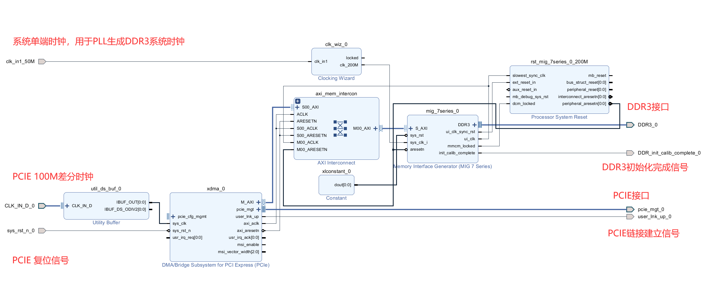

# FPGA xdma Demo

硬件：Memblaze pblaze3 (XC7K325TFFG900-2)

开发软件：Vivado 2019.1 @ windows

运行环境：ubuntu20.04 LTS 

### 速度测试（基于一个M.2 NVME转PCIE x4显卡转接线，运行在我的笔记本上）

写入随机1GB数据后读取，并使用diff对比确认：

BD一览

## 如何最简创建一个xdma的demo，实现基于PCIE的PC对fpga的读写

todo

